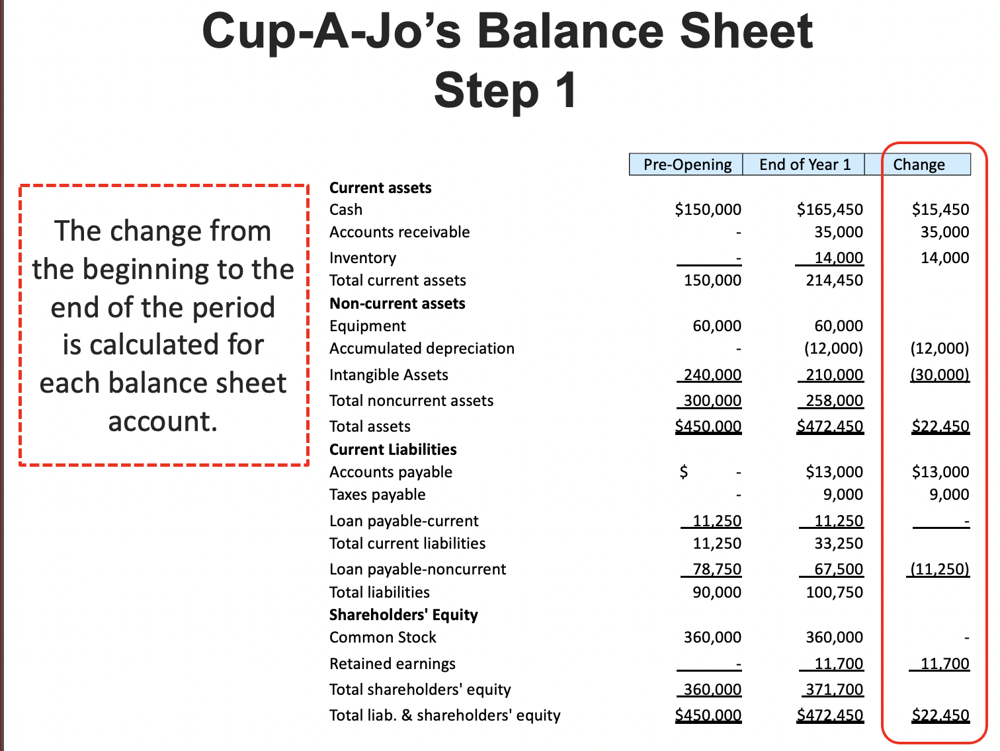

# Measuring performance: cashflow

## Cash flow

Statement of cash flows conveys different information vs balance sheet in a way    

- Activity type: operating, investing, financing
- Liquidity
- Earnings quality
- Additional details: impairments, stock based compensation, equity income 

**Beginning cash + change cash = ending cash** 

## Five Steps to Cash Flow

1. Calculate the change in each balance sheet account
    1. Verify that the net change in assets equals the net change in liabilities and shareholders’ equity
    2. Calculate the change in each balance sheet account
    3. Verify that the net change in assets equals the net change in liabilities and shareholders’ equity
    
2. Identify the cash-flow activity category for each balance sheet account
    1. Operating activities
        - Associated with day-to-day operations
    2. Financing activities
        - Associated with raising capital to finance a business
    3. Investing activities
        - Associated with purchasing and selling long-term assets needed to run a business
    4. Long-term assets have 2 cash flow activities

**Note**: Only flip side when it's an assest class

## Operating Funds Ratio
The portion of a business's cash flow provided by earnings 

operationg funds ration = Cashflow From Operations / Net Income

Operating fun ration = 
$\frac{Cash Flow From Operation}{Net Sale}$

Ratio is often 1.0 for companies
- During expansion, will be less than 1.0
- During contraction, will be greater than 1.0

### Example 
Operating funds ratio for Cup-A-Jo = $\frac{54700}{39700}$ = 1.4     

**Cash generated by Cup-A-Jo’s earning s 140% of total net income.**

 

provides information about liquidity 
indicates the extent to which a copmany's current obligations can be paid using operationg cash flow 

$\frac{Cash From Sales}{net sale}$

## Free Cash Flow ( FCF) 
- Reveals the strength of a company's cash flow 
- Less subjec to accounting trickery resulting from accural basis net income 
- Indicates how mch cash flow is avaibale for general corporate use 

Free cash flow = cashflow from operation - capital expenditures

## Discretionary Cash Flow (DCF)

Discretionary cash flow = cash flow from operations - required debt payments - dividend payments 

