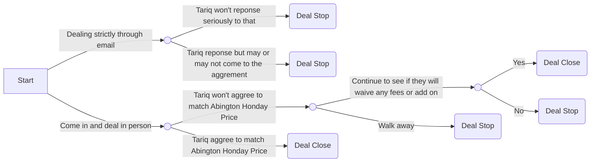

```mermaid
graph LR
    A[Start] -- Dealing strictly through email --> B(( ))
    A[Start] -- Come in and deal in person  --> F(( ))
    B -- Tariq won't reponse seriously to that --> D(Deal Stop)
    B -- Tariq reponse but may or may not come to the aggrement --> E(Deal Stop)
    F -- Tariq won't aggree to match Abington Honday Price --> G(( ))
    F -- Tariq aggree to match Abington Honday Price --> H(Deal Close)
    G -- Continue to see if they will waive any fees or add on --> J(( ))
    G -- Walk away --> K(Deal Stop)
    J-- Yes --> L(Deal Close)
    J-- No --> M(Deal Stop)
```