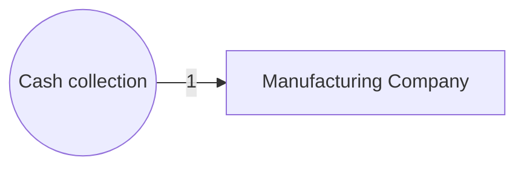

# Inventory 
Beginning Inventory + Purchases = Ending Inventory + COGS

- Balance Sheet - not yet sold 
- Income statement - sold inventory (COGS)
- Capitalization ( on balance sheet)
    * Any cost necessary to get inventory ready for sale 
- Manufactoring firms have theree types of inventory 
    1. Raw materials
    2. Work-in-Process
    3. Finished goods 

#Todo: complete this diagram latter

## Methods  of Costing Inventory 
All methods produce different costs assigned to cost of goods sold and inventory 
- First-in, First-out (FIFO)
- Last-in, First-out(LIFO)
    * **Note:** If used for tax must also be used for financial reporting 
- Average Cost
- Specific Identification 

## Chooosing a method
Inventory method can be driven by: 
- Prevailing standards
- Physical flow ( e.g. oldest dairy products)
- Desire to report higher profits
- Desire to pay lower taxes

**Note:** Companies should stay consistent from year to year 
- Can be changed when companies think it will provide more meaningful financial picture 
- Frequent changes are considered a "red flag"

## NVR 
Lower of COst of Net Realizable Value 
- If estimated selling price is less than recorded book value => write down inventory to the lower replacement cost

- If estimated selling price is greater than recorded book value => Inventory value remains at its cost. 

**Ex:**

At the end of the year, Yard Town hand 200 hoses in inventory with a recorded cost of 6$ each. The estimated selling price of each hose just dropped to 5$

- Estimated selling price of inventory: 5$ x 200 = 1000$
- Current book value from the accounting records: 6$ x 200 = 1200$

## LIFO Reserve
- Difference between the replacement cost of ending inventory and the LIFO cost of ending inventory 

- Companies must disclose this reserve 
    * Enables users to determine the fair market value 

LIFO Inventory (Reported) + LIFO Reserve = Replacement COst of Inventory 

LIFO COGS (reported) - Increase in LIFO Reserve = Replacement Cost of COGS

## Managing Inventory 
- Inventory creates costs
    * Purchase and/or manufacturing costs
    * Warehousing costs
    * Insurance costs
- Inventory reduction using methods like Just-in-time inventory 
- Assessment of inventory management 
    * Use the inventory-on-hand period calculation 
    * $\frac{365}{COGS/Inventory}$  

**Note:** inventory-on-hand period need to be low. Which indicate faster turn over 

## Managing Accounts Payable 
- Accounts paybale 
    * Credit extended, often interest free
    * Can also carry early payment discounts
- Payment of oustanding accounts payable with the discount period is advantageous 

## Days' Payable Period 

- Measures the extent to which a firm utilizes interest-free vendor financing
- The longer the period, the greater the potential of being a future credit risk 

**Note:** long payable period generally a red flag, however it need to be consider along with contractuat, industry standard/norm, liquidation.... 

