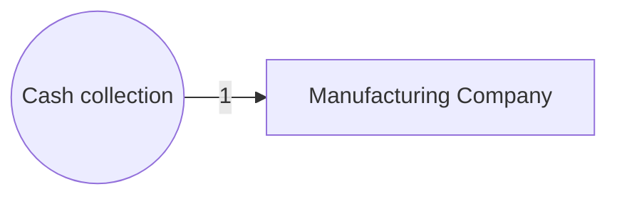

# Inventory 
Beginning Inventory + Purchases = Ending Inventory + COGS

- Balance Sheet - not yet sold 
- Income statement - sold inventory (COGS)
- Capitalization ( on balance sheet)
    * Any cost necessary to get inventory ready for sale 
- Manufactoring firms have theree types of inventory 
    1. Raw materials
    2. Work-in-Process
    3. Finished goods 

