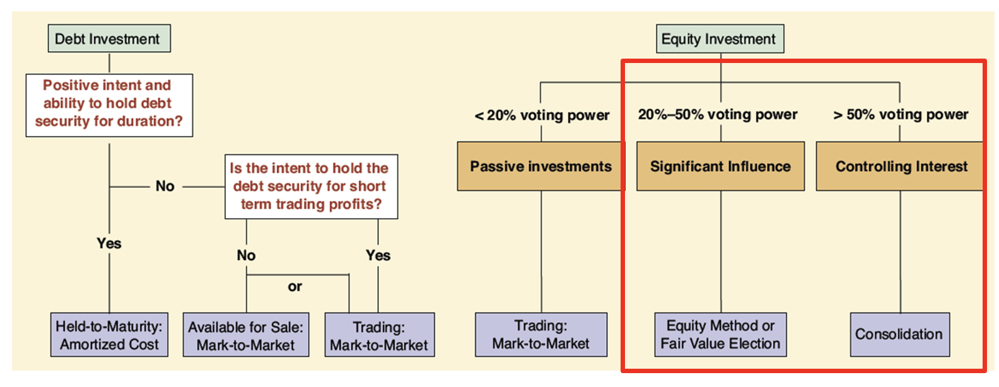
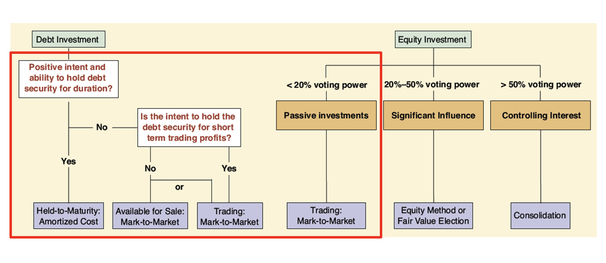

# Invest In Other Entity

Why? 

* Passive Investments (<20% voting power)
    - Indicates an expectaion that the investment will provide an acceptable rate of return for idel funds
    - Investor-company does not intend to take an active role in management of investee
* Active Investments(20%-100%)
    - Investor company desires active role in investee's business 

## Method

### Equity Method 

* When parent has 20-50% ownership
    - Investor can exercise influence over investee
    - Under 50% means not enough to have voting control 
* Investment account on B/S equals: 
Investment account on b/s = original cost + proportionate share of net income/loss - proportionate share of dividends 

`` Share of net income treated as earnings to investor``

`` Share of dividends treated as return of capital ( not earnings)``

### Consolidation Method 

* larger than 50% ownership
    - Investor has voting control 
    - Single set of financial statement for combined companies
    - Referred to as purchase accounting 

* When purcahse price > fair market value of affiliate firm 
    - Goodwill is present 
    - Parent must adjust assets and liabilities to the fair market values on the consolidated balance sheet 

## Marketable Securities 
* Either debt or equity securities 
    - Trading, Available-for-sale, or Held-to-maturity are three possible accounting treatments
* Shareholding percentage is relatively small 
    - Less than 20 percent 
* Mark-to-market accounting is used
    - For all equity securities, and for debt securities by election if holding period is short
    - Securities are written up or down to the current market value 

``Market adjustments are justified because a ready resale market exists making the investment's current value reliably ascertained``

## Passive Investment

## Trading Security 

* Applied to all equity securities
* Valued at market value on the B/S
    - Unrealized gain of loss included in the investor’s net income
* Unrealized vs realized gain or loss
    - Unrealized: change in market value not yet sold
    - Realized: profit or loss on the sale of the asset

## Available-for-Sale vs Held-to Maturity
* Available for sale 
    - Can be elected for debt securities management expects to sell before maturity
    - Values at market value on B/S
    - Unrelized gain or loss part of other comprehnsive income 

* Held-to-maturity
    - Debt securities that management expects to hold until maturity
    - Valued on B/S at amortized cost   
        * Original purchase price +/- purchase discount or premium 

# Investing in Other Entities

## Foreign Operations 
* U.S companies locate operations in other countries 
    - Partial operation such á a sales office
    - Entire operating subsidiary 
* Exchange rate fluctuations
    - Financial results of foreign subsidiaries must be converted from the local currency into the currency of the parent company
    - Translation is used to account for exchange rate fluctuation 
    
