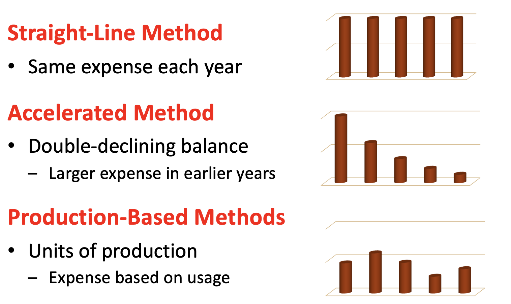

# Long Term Assest 

## Long-Lived Asests Capitalization Capitalization
* Newly acquired long-lived asets capitalized/valuedd at cótt

* Acquisition Costs
    - All cost necessary to purchase, transport, and prepare asset to be productive 
    - Including: taxes, employee training, modifications to facilities

* Other capitalized costs
    - retooling costs and interest related to this retooling
    - Retooling interest is sdisclosed separately 

`Note: All of these cost will go balance sheet `

## Maintenance vs. Betterment 

* Maintenance 
    - Routine
    - expensed on the income statement 

`Note: Impact the income statement but not the balance sheet`

* Betterment
    - Non0routine
    - Capitalized on balance sheet
    - Criteria (meet one)
        - extends life, improves quality of product, reduces expense associate w/asset 

`Note: when certain thing get classify as income statement the cost get deducted that year. When it get on balance sheet, it will get deduct over time`

## Long-lived Assets Cost Allocation 
* Long-lived asset categories
    - Fixed assets
    - Intangible assets
    - Natural resources

* Long-lived asset cost are allocated over time assets are used or are productive 
    - Fixed assets: Depreciation 
    - Intangible: Amortization
    - Natural resources: Depletion 

## Cost Allocation Procss 
* Purpose to match cost with the revenue generated by asset's use 
    - Not the goal to mirror market value 
    - Regardless of method same total expense over time 
* Management must decide 
    - Method; Useful life; Salvage value 
* Companies can choose different methods for financial reporting and taxes
    - Straight-line for financial reporting 
    - MACRS for tax 

## Allocation Approaches for fixed Assets 

### Straight-Line Method 

Allocates the capitalized cost of an asset equally over the expected productive life

Operating expense for one period = $\frac{1}{n}$(Acquisition cost - Residual value)

Where n = Asset’s expected useful life in months or years, and Residual value = Estimated amount the asset can be sold for at the end of its useful life

### Double-Declining Balance Method
Results in the asset to be depreciated at a faster rate than straight-line 

Operation expense for one period = $\frac{2}{n}$ (Book value)

`n = asset’s expected useful life in months or years`

### Units-of-Production Method

Relevant if the expected useful life is based on an asset’s usage rather than the passage of time.

Depreciation expense for one period  = $\frac{OutPutConsumeThisPeriod}{TotalEstimatedLifeTimeOutPut}$ (Aquisition Cost - Residual Value)

## Long-Lived Asset Revaluation 
* GAPP requires downward revaluations 
    - Depreciation 
    - Impairment when future earning generation capacity declines
* In other countries market valuation is allowed 
    - E.g. UK, Australia, New Zzeeland
    - Possibility for upwad adjustment 
    - Accounted for using asset revaluation reserve 

## Impairment 
* An asset is impaired when 
    - It is no longer expected to produce previously anticipated levels of revenue or cash flow 
    - See Marriot example below from March 2020 

## Sale or Retirement of Long-Lived Assets 
* Must remove the asset's remanining book value from the accounting records
    - Requires two removals
        1. remove the cost of the asset being sold
        2. Remove the related accumulated depreciation of the asset being sold 

Proceeds from sale > Book value of the asset = Gain 
Proceeds from sale < Book value of the asset = Loss 

## Intangible Assets

* Revenue producing assets (typically long lived), not in physical form 
    - Intellectual property amortized using straight-line
    - Goodwill from merger and acquisition

Goodwill = purchase price of target firm - fair market net asset value of firm 

### Goodwill Impairment
* Goodwill not subject to amortization 
    - Evaluated annually for impairment 
        * ``results in reduction of goodwill(B/S) and impairment loss(I/S)``
        * `` should be rare ``
* Evaluating goodwill for impairment under U.S. GAAP 
1. Identify the amount of goodwill associated with each prior corporate acquisition 
2. Investor company estimates the value of goodwill asscoiated with each pror acquisition if the acquired entity were acquired at its current market value 

### Intangibles Other Issues 
* R&D 
    - Expensed under GAAP; Development costs can be capitalized under IFRS 
    - Can lead to inflated profit margins when develop product comes to market 

* Marketing and Advertising 
    - Expensed under GAAP and IFRS 
    - Difficult to assess profitability so decision to expense when incurred 

### Natural Resource 
* Assets of te company, defined as materials or substances that occur in nature and that can be  used for economic gain 
    - Examples: standing timber, oil and gas, iron ore, coal..
* When purchased from other natural resource companies, these assets are reported on the balance sheet at their acquisition cost
* When internally developed by a resource comapny, 2 valuation approaches are available

## Analyzing Capital Investments 
* The amount of a company's capital investment is identifiable from the investing activities section of the statement of cash flow 

* Usually segmented into 2 categories: 
1. Maintenance capital expenditures
2. Incremental betterment capital expenditures 

* Estimate of the number of years before a major capital sset refinancing will be required: 

Estimated number of years remaining = [100 - $\frac{AccumulatedDepreciation}{GrossPPE}$] x Average Life Expectancy 

* Thing to look for: 
    - Is the deprecation method consistent with industry standard?
    - Were there changes in depreciation methods?
    - Is the company capitalizing any expenditures that would be more appropriately an expense?
    - Are there capital investment write downs?
    - Is the company capitalizing a significant amount of interest costs?

