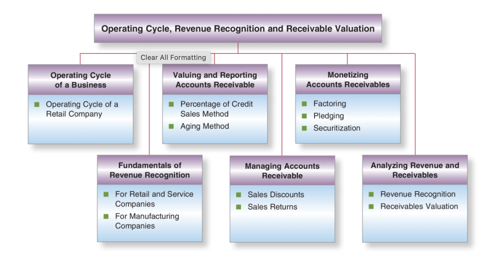
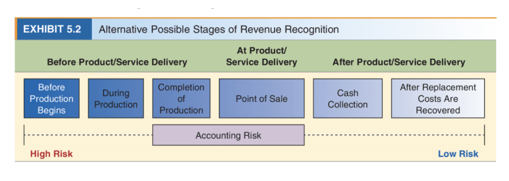
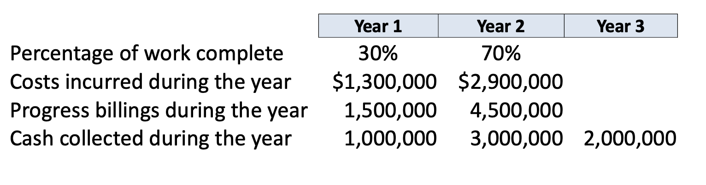
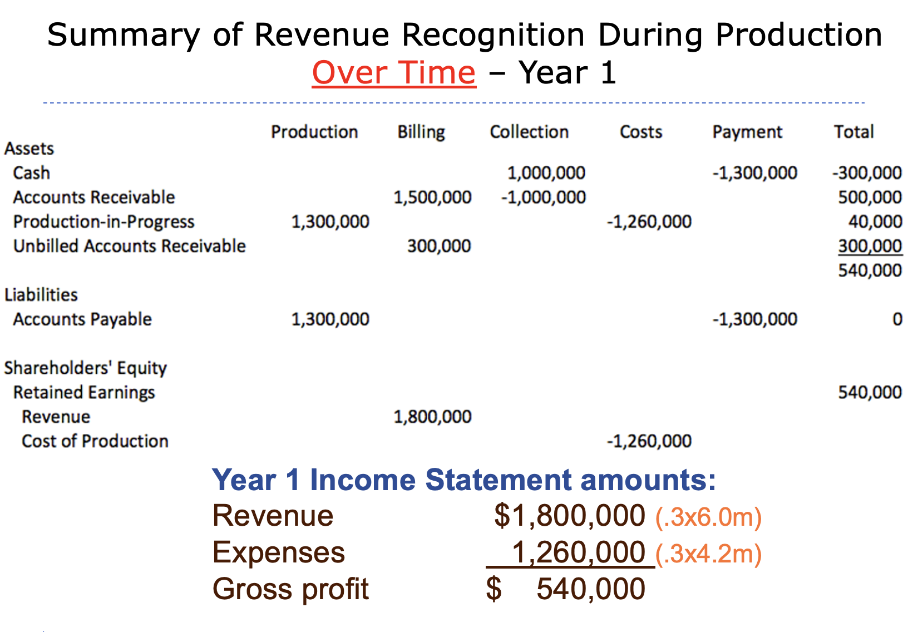
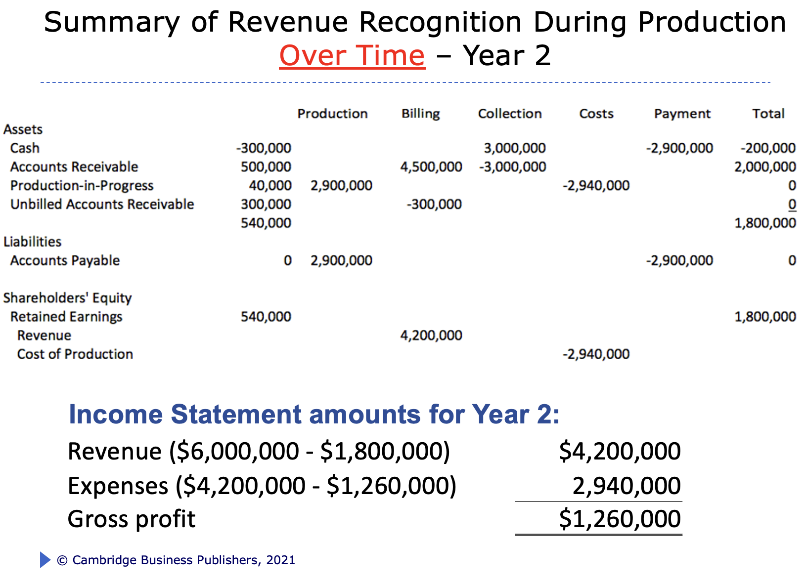
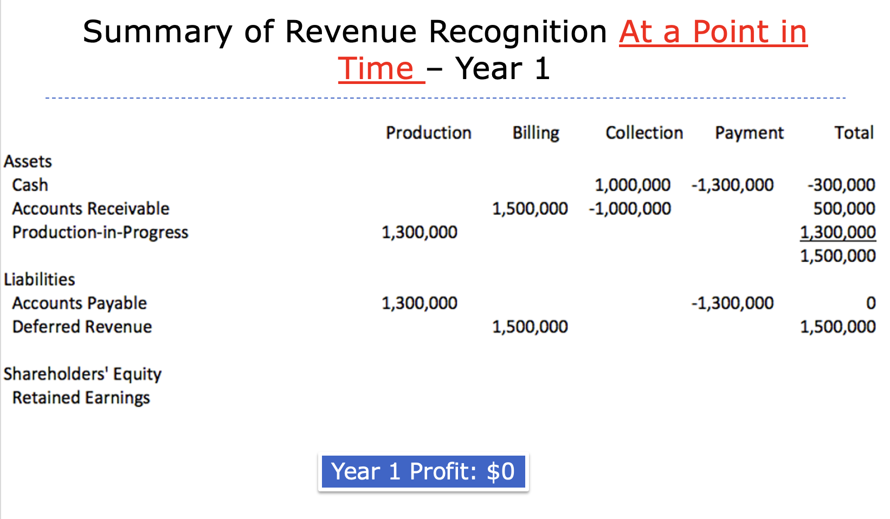
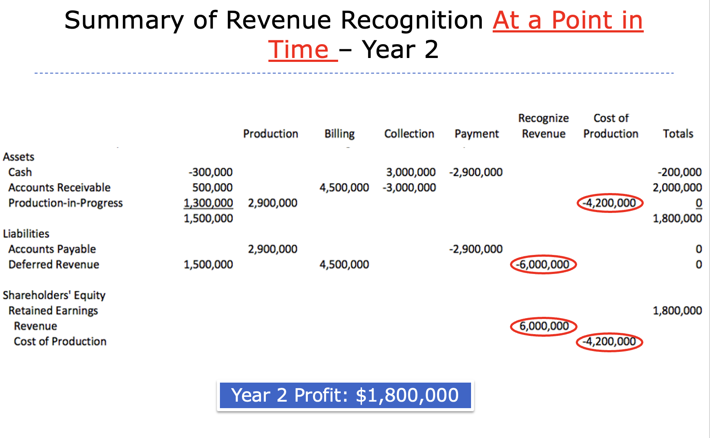

# Revenue
 

 - Revenue: inflow of assets to a business that occurs as a direct consequence of providing goods or servcices to customers 

 - To be recongnized (report on B/S and I/S)
    * transfer of goods or services. Seller has met obligation 
    * entitled to consideration. Seller has been paid or payment is reasonably assure 

## 5-step recongnition model
1. identify the contract with a customer 
2. Identify the seperate performance obligations in the contract 
3. Determine the transaction price 
4. Allocate the transaction price to the seperate performance obligations in the contract. 
5. Recognize revenue when the company satisfies a performance obligation. 

## Timing 

## Revenue Recognition over time
- Long term contracts recognized either: 
   * over time
   * at a point in time 

**Over Time - Year 1**

**Over Time - Year 2**

**Point In Time - Year 1**

**Point In Time - Year 2**

# Revenue and Account Recievable 

## Account Recievable 

- Sales on credit
- Cost of extending credit
- Reducing risk of uncollectible accounts 

## Estimating Uncollectible Accounts 

- Two common methods: 
   * Percentae of credit sales method
   * Aging method 

## Allowance for Uncollectible Accounts

The amount of total accounts receivable management believes it will not collect 
- A reserve for expected future losses
- Appears on the balance sheet as reduction to Accounts Receivable (contra assest)
- Also called Allowance for doubtful accounts or Reserve for doubtful accounts 

**Note:** 
Allowance for Uncollectible Accounts (beginning balance) 
-Write offs of uncollectibles 
+Bad debt expense during the perid 
=Allowance for Uncollectible accounts (ending balance)

## Percent of credit sales method 
Tie the amount of expense for uncollectible accounts directly to the credit sales during a period
- Example of the matching concept

The allowance for the uncollectible accounts on the balance sheet is the result of expensing directly against credit sales (and later write-offs of specific accounts)

## Aging method
Most widely used approach of estimating uncollectible accounts

Categorizes receivables on how much time has elapsed since the credit sale occurred
- (Older receivables considered less likely to be collected)

Allowance for uncollectible accounts on the balance sheet is estimated totals from the aging schedule

## Effective Management of Accounts Receivable 
1. Minimize receivables collection period    

$\frac{365}{netsales / AR-balance}$

2. Monetize   
    * Factoring: sell receivables to third party
    * Pledging: use receivables as collateral for a loan 
    * Securitization: entity is set up to buy company's receivables 

## Additional Concepts
- Front-end loading
- Back-end loading
   * company usually do this to defer tax 
- Understatement of collection risk
   * Understates bad debt expense b/c of allowance
   * Evaluate ratio of allowance for uncollectible accounts over gross accounts receivables 
